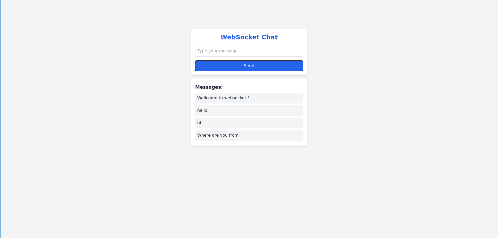

# WebSocket Application

A simple WebSocket-based application that demonstrates real-time messaging between a client and a server. This app features a Node.js backend using the `ws` library to handle WebSocket connections, and a React frontend to send and receive messages.

## Features

-   **Backend**:
    
    -   WebSocket server with Node.js and `ws` library.
    -   Broadcasts messages to all connected clients and sends a greeting to new clients.
-   **Frontend**:
    
    -   Built with React.
    -   Establishes WebSocket connection for real-time messaging.
    -   Displays messages with an input field and button.

## Tech Stack

-   React 
-   Typescript
-   Tailwind CSS
-   Node JS

## Screenshots



## Prerequisites

Before you begin, ensure you have the following installed on your local machine:

- **git** 
- **Node.js** (v16 or later) 
- **npm** (Node Package Manager)

## Local Setup

1. Clone the Repository

	```bash
	git clone https://github.com/kundusubrata/websocket.git
	cd websocket
	```
2. Run the Development Server
	```bash
	npm run dev
	```
	This will start the development server at `http://localhost:5173`.
